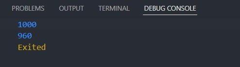
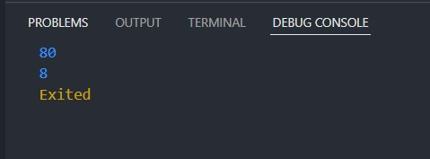

# 10 Dart Object Oriented Programming 2

## Resume

Dalam materi ini, mempelajari:

1. Constructor
2. Inheritance
3. Method Overriding
4. Interface
5. Abstract Class
6. Polymorphishm
7. Generics

### Constructor

adalah method khusus yang akan dieksekusi pada saat pembuatan objek

### Inheritance

Pewarisan/Penurunan adalah konsep pemrograman dimana sebuah class dapat 'menurunkan' property dan method yang dimilikinya kepada class lain.

### Method Overriding

adalah sebuah situasi dimana method class turunan menimpa method milik parent class.

### Interface

adalah template untuk class dimana semua method di dalamnya harus diimplementasikan ulang oleh class yang memakainya ( mengimplementasikannya).

### Abstract Class

adalah sebuah class yang tidak bisa di-instansiasi (tidak bisa dibuat menjadi objek) dan berperan sebagai 'kerangka dasar' bagi class turunannya.

### Polymorphishm

merupakan sebuah konsep OOP di mana class memiliki banyak “bentuk” method yang berbeda, meskipun namanya sama. Maksud dari “bentuk” adalah isinya yang berbeda, namun tipe data dan parameternya berbeda.

### Generics

adalah salah satu cara pembuatan class dan method yang dapat digunakan untuk semua jenis tipe data, sehingga penggunaannya lebih fleksibel dan tidak kaku terhadap satu jenis tipe data saja

## Task

### Mencari volume bangun ruang

[task1.go](./Praktikum/task_1.dart)

output:

### Mencari hasil KPK dan FPB

[task2.go](./Praktikum/task_2.dart)

output:

