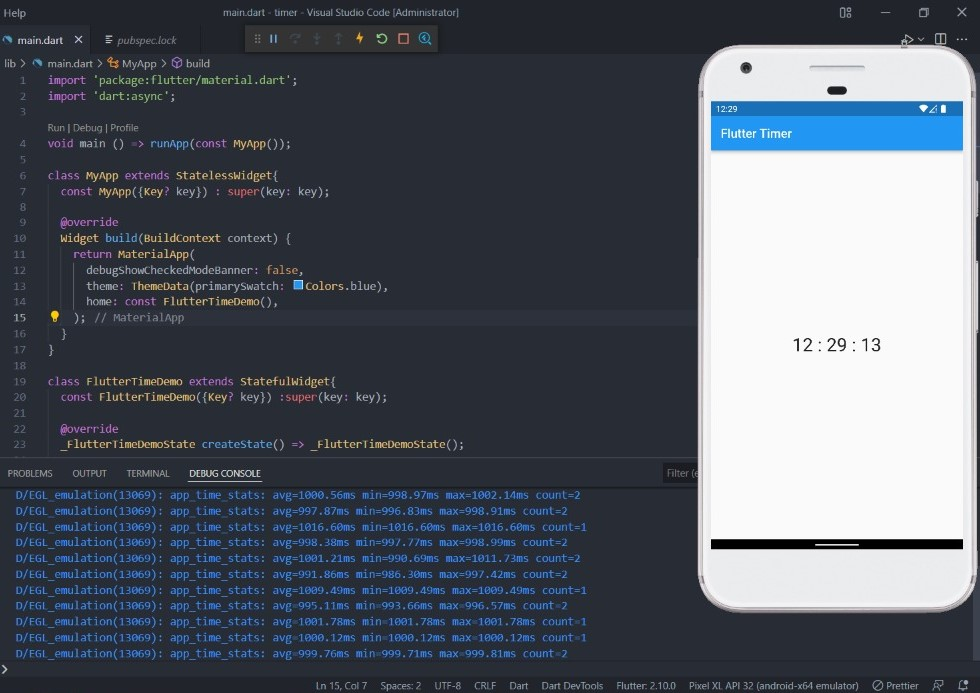

# 11 Introduction Flutter Widget

## Resume

Dalam materi ini, mempelajari:

1. Perkenalan Flutter
2. Widget
3. Stateless Widget
4. Stateful Widget
5. Built In Widget

### Perkenalan Flutter

Flutter adalah sebuah framework open-source yang dikembangkan oleh Google untuk membangun antarmuka (user interface/UI) aplikasi Android dan iOS. adapun keunggulan dari Flutter yaitu:

1. Pengembangan Aplikasi Lebih Mudah dan Cepat
2. Biaya Pengembangan Lebih Hemat
3. Dokumentasi yang lengkap

### Widget

Widget adalah komponen-komponen pendukung pada Flutter seperti Button, Text, Icon dan lain sebagainya.

### Stateless Widget

merupakan suatu widget yang dimuat secara statis dimana seluruh konfigurasi yang dimuat didalamnya telah diinisiasikan sejak awal widget tersebut dimuat.

### Stateful Widget

merupakan suatu widget yang sifatnya dinamis atau dapat berubah-ubah, kebalikan dari stateless widget. adapun Stateful widget dapat mengubah atau mengupdate tampilan, menambah widget laiinya, mengubah nilai variabel, icon, warna dan masih banyak lagi

### Built In Widget

adalah Widget yang dapat langsung digunakan dan sudah ter-install bersamaan dengan flutter.

## Task

### Membuat Stateful widget yang kontennya dapat berubah setiap detik

[task.go](./Praktikum/lib/main.dart)

output:

