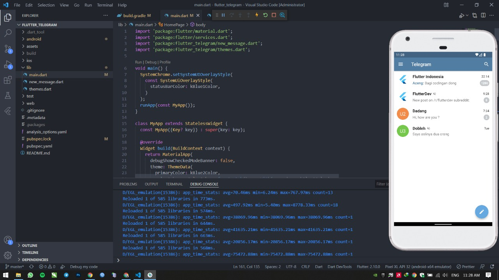

# 12 Platform Widget

## Resume

Dalam materi ini, mempelajari:

1. MaterialApp
2. CupertinoApp

### MaterialApp

widget yang mengiplementasikan desain untuk bahasa android, iOS, web, dan destkop

### CupertinoApp

widget yang mengiplementasikan desain khusus untuk bahasa iOS

## Task

### Membuat tampilan telegram dengan flutter material

[task.go](./Praktikum/lib/main.dart)

output:

