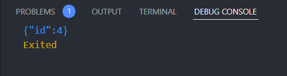
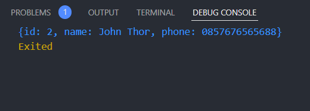

# 24 Introduction REST API – JSON serialization/deserialization

## Resume

Dalam materi ini, mempelajari:

1. REST API
2. HTTP
3. Dio
4. Serialisasi JSON

### REST API

singlkatan dari Representational State Transfer Application Programming Interface. merupakan arsitektural yang memisahkan tampilan dengan proses bisnis dan bagian tampilan dengan proses bisnis berkirim data melalui HTTP request

### HTTP

merupakan protokol yang digunakan untuk berkirim data melalui internet, biasanya data tersebut berbentuk media web. adapun pola komunikasi HTTP dengan cara 1. client mengirim request, 2. Server mengolah dan membalas dengan memberi response. HTTP dibagi menjadi dua struktur yaitu:

1. Struktur Request
   terdiri dari
   - URL
     alamat halaman yang akan diases
   - Method(GET, POST, PUT, DELETE)
     Menunjukan aksi yang diinginkan
   - Header
     Informasi tambahan terkait request yang dikirmkan
   - Body
     Data yang disertakan bersama request
2. Struktur Response
   - Status Code
     Kode yang mewakili keseluruhan response, baik sukses maupun gagal
   - Header
     Informasi tambahan terkait response yang diberikan
   - Body
     Data yang disertakan bersama response

### Dio

sebagai HTTP client dan dimanfaatkan untuk melakukan REST API

### seriaslisasi JSON

JSON merupakan singkatan dari JavaScript Object Notation. JSON adalah cara penulisan data dan umum digunakan pada REST API. JSON dibagi menjadi dua yaitu

1. Serialisasi JSON
   mengubah struktur data ke bentuk JSON dan menggunakan fungsi jsonEncode dari package dart:convert
2. Deserialisasi JSON
   mengubah bentuk JSON ke struktur data dan menggunakan fungis jsonDecode dari package dart:convert

## Task

### melalukan POST menggunakan dio

[task1.go](./Praktikum/bin/s_24.dart)

output:

### merubah JSON kedalam bentuk object dari suatu class

[task2.go](./Praktikum/bin/s_24.dart)

output:

