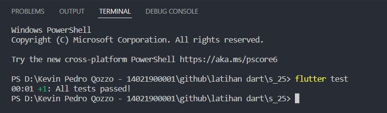

# 26 Finite State Machine & Unit Testing

## Resume

Dalam materi ini, mempelajari:

1. Finite State Machine
2. Unit Test
3. Mocking

### Finite State Machine

merupakan mesin yang memiliki jumlah state dan tiap statenya menunjukkan apa yang terjadi sebelumnya.
Contoh:
terdapat 3 state yang menunjukkan kejadian dalam suatu proses.

- IDDLE saat tidak terjadi proses
- RUNNING saat proses sedang berjalan
- ERROR saat proses gagal diselesaikan

Contoh sukses:

- IDDLE berubah menjadi RUNNING saat proses berjalans
- RUNNING kembali menjadi IDDLE saat proses selesai

Contoh gagal:

- IDDLE berubah menjadi RUNNING saat proses berjalan
- RUNNING menjadi ERROR saat terjadi kegagalan
- ERROR kembali menjadi IDDLE

### Unit Test

merupakan salah satu jenis pengujian pada perangkat lunak, pengujian tersebut dilakukan pada unit dalam perangkat lunak. Unit yang dimaksud umummnya adalah fungsi atau method. tujuan unit test adalah untuk memastikkan fungsi dapat mengolah berbagai jenis input. memastikan hasil dari suatu fungsi atau method sudah sesuai

### Mocking

merupakan proses yang terikat dengan sistem eksternal dapat mempengaruhi berjalannya pengujian, Pengaruh tersebut dapat menggangu proses pengujian. dilakukan mocking untuk menghindari masalah-masalh tersebut.
Cara kerja mocking:

- suatu objek dibuat bentuk tiruannya
- Bentuk tiruan tersebut memiliki input dan output yang sama dengan yang asli
- Bentuk tiruan menghilangkan ketergantungan pada sistem eksternal

## Task

### Membuat halaman dengan MVVM

[task1.go](./Praktikum/lib/model/api/menu_api.dart)

output:

### Melakukan unit test dengan menerapkan mocking

[task2.go](./Praktikum/test/model/api/menu_api_test.dart)

output:

