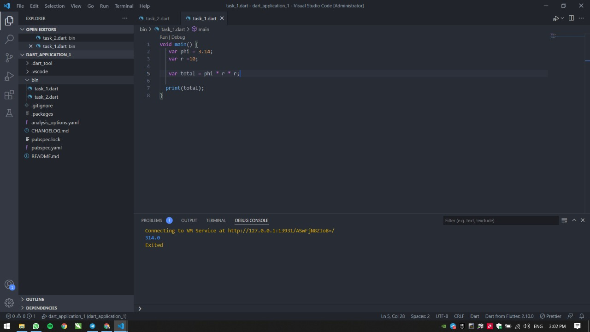
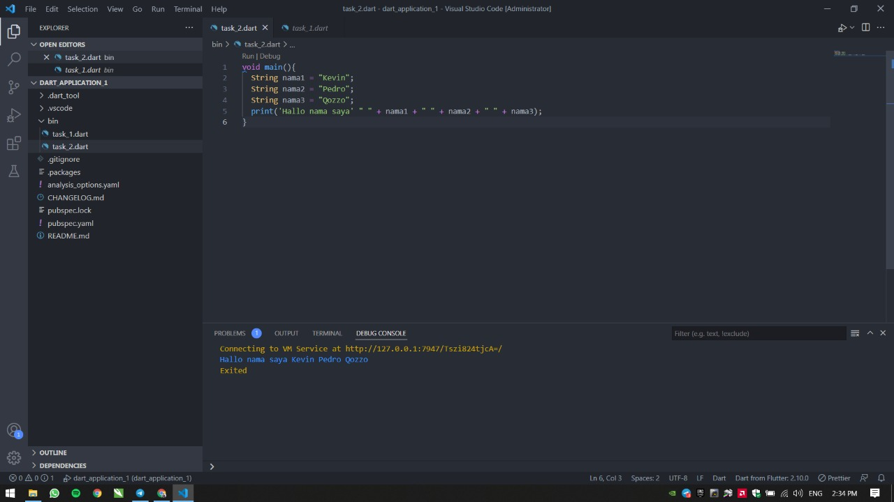

# 4 Introduction to Algorithm and Dart Programming

## Resume

Dalam materi ini, mempelajari:

1. Dart

### Dart

Adalah merupakan bahasa pemrograman yang dikembangkan oleh google untuk kebutuhan dalam membuat aplikasi android atau mobile, front-end, web, IoT, back-end (CLI), dan Game. Adapun tipe data dan operator dari dart antara lain :
Tipe Data :
Int: bilangan bulat
double: bilangan pecahan
bool: Menghasilkan nilai true/false
string: teks

Operator:
Arithmetic: Untuk perhitungan matematis
Assigment: Memberi nilai pada variable
Comparison: Membandingkan kesetaraan nilai
Logical: Menggabungkan beberapa kondisi

## Task

### Mengimplementasikan rumus luas lingkaranan

[task1.go](./praktikum/../task1.go)

output:

### Membuat variabel berupa string

[task2.go](./praktikum/../task2.go)

output:

