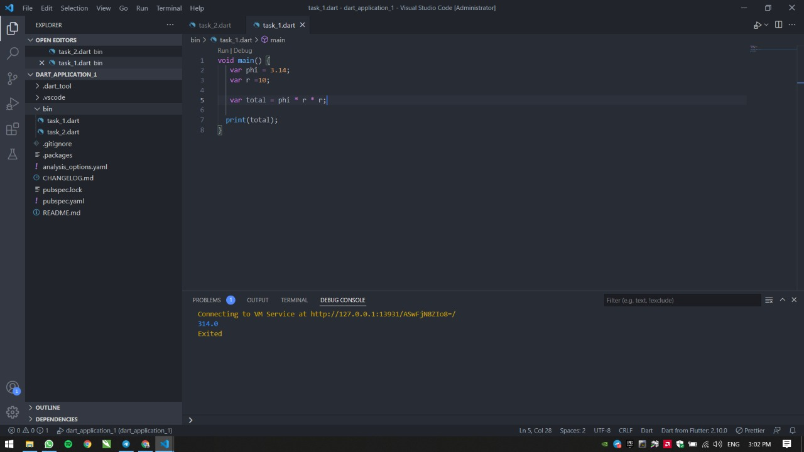
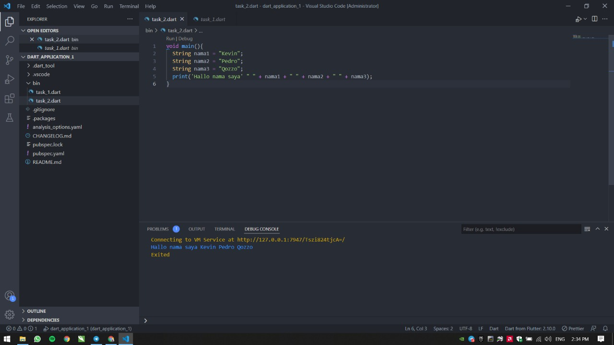

# 5 Basic Dart Programming

## Resume

Dalam materi ini, mempelajari:

1. Anonymous Function
2. Arrow Function
3. Async-Await
4. Future
5. List
6. Map

### Anonymous Function

fungsi anonymous merupakan fungsi yang dibuat tanpa menggunakan nama. Tujuan dari penggunaan fungsi ini adalah untuk langsung bisa mengeksekusi fungsi tersebut tanpa harus memanggil lagi nama fungsi tersebut

### Arrow Function

dapat kita gunakan untuk membuat sebuah fungsi secara lebih sederhana dan ringkas. Jika fungsi yang kita buat hanya memiliki satu baris expression, maka arrow function akan menganggapnya sebagai return statement.

### Async-Await

merupakan sebuah syntax khusus yang digunakan untuk menangani Promise agar penulisan code lebih efisien dan rapih.

### Future

adalah data yang dapat ditunggu, membawa data return dari fungsi async

### List

berguna untuk meyimpan data secara berbaris dan tiap datanya memiliki index

### Map

berguna untuk menyimpan data secara key-value

## Task

### Mengimplementasikan rumus luas lingkaranan

[task1.go](./Praktikum/task1.go)

output:

### Membuat variabel berupa string

[task2.go](./Praktikum/task2.go)

output:

