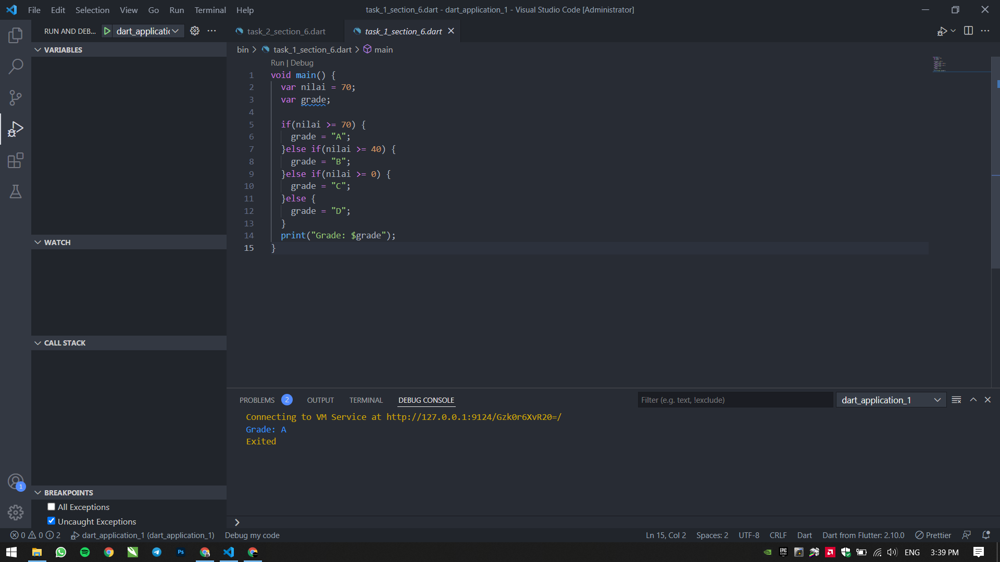
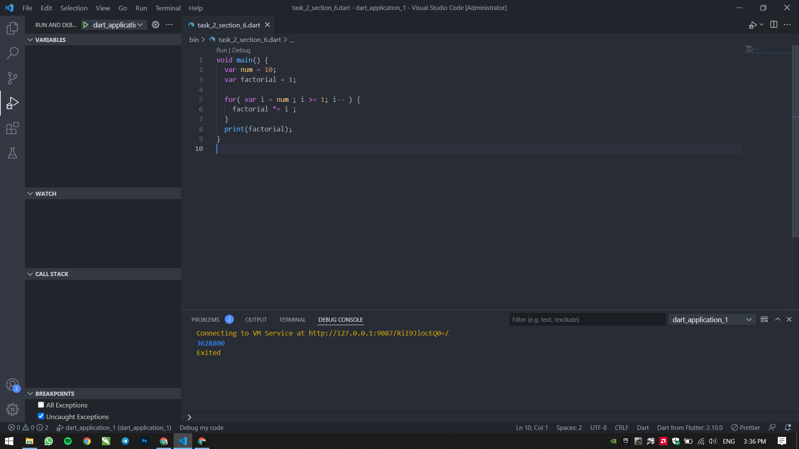
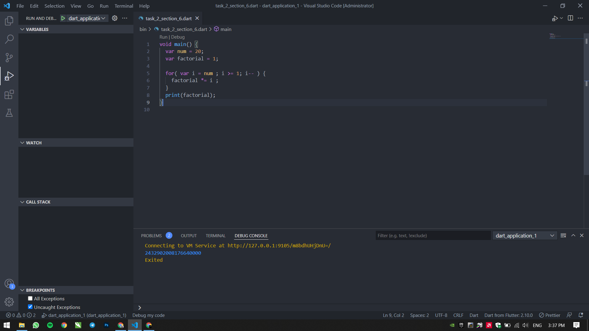
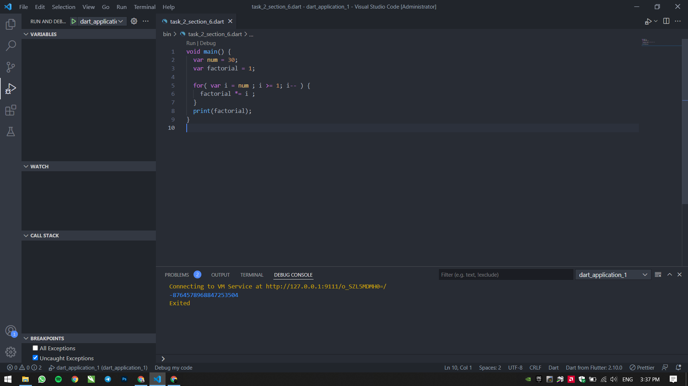

# 6 Branching, Looping, Function 1

## Resume

Dalam materi ini, mempelajari:

1. Pengambilan Keputusan
2. Perulangan
3. Beak dan Continue
4. Fungsi

### Pengambilan keputusan

adalah operasi yang digunakan untuk menyelesaikan masalah-masalah yang berhubungan dengan kondisi benar atau salah dari suatu pernyataan. Bentuk pernyataan tersebut berupa perbandingan antara dua buah nilai dengan menggunakan operator pembanding.

### Perulangan

adalah sebuah urutan perintah yang secara menerus diulang hingga suatu kondisi tercapai. Kondisi yang dimaksud disini dapat dalam bentuk yang berbeda-beda seperti; mendapatkan data dan merubah data, dan apakah sebuah nilai sudah mencapai jumlah yang ditentukan.

### Break dan Continue

Break akan menghentikan perulangan atau iterasi dan keluar dari perulangan, sedangkan Continue akan secara otomatis menghentikan iterasi yang sedang berjalan dan lanjut ke iterasi berikutnya.

### Fungsi

adalah kumpulan kode yang dapat digunakan ulang

## Task

### Menentukan nilai yang sudah ditentukan

[task1.go](./Praktikum/task1.go)

output:

### Menampilkan nilai faktorial

[task2.go](./Praktikum/task2.go)

output:

