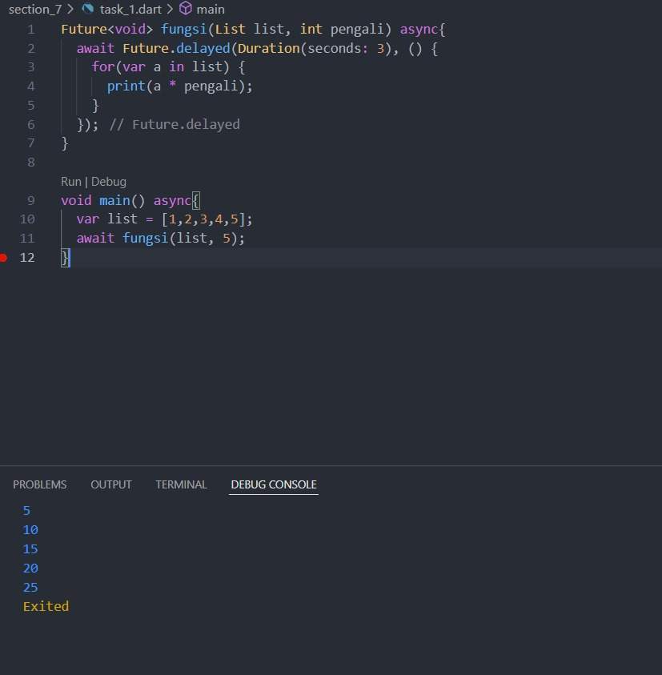
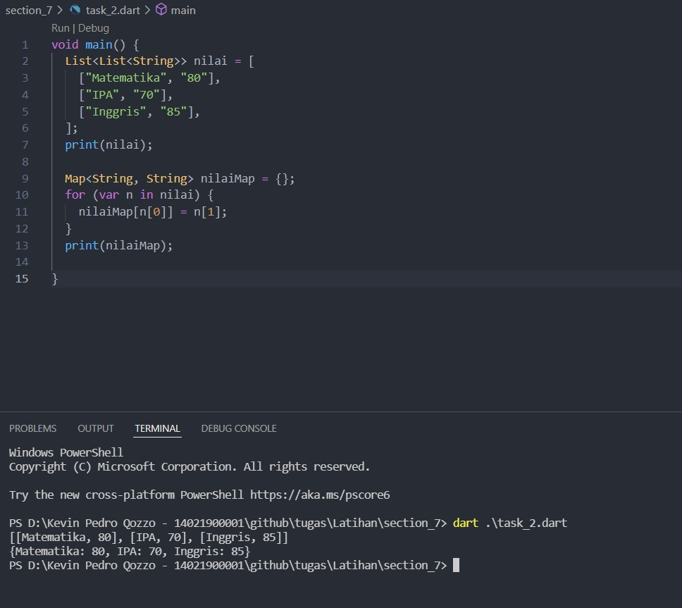

# 8 Collection

## Resume

Dalam materi ini, mempelajari:

1. Function
2. Aync-Await
3. Tipe data Future
4. Collection

### Function

adalah sub modul atau sub program yang dibuat untuk menyelesaikan hal tertentu. adapun function lanjutan (advance function) yaitu "Anonymous Function dan Arrow Funtion"
Anonymous function merupakan fungsi yang dibuat tanpa menggunakan nama. Anonymous function juga bisa dimasukkan dalam sebuah variabel dan bisa di eksekusi denga memanggil variabel tersebut.
Arrow function dapat kita gunakan untuk membuat sebuah fungsi secara lebih sederhana dan ringkas. Jika fungsi yang kita buat hanya memiliki satu baris expression, maka arrow function akan menganggapnya sebagai return statement.

### Async-Await

dapat menjalankan beberapa proses tanpa perlu menunggu. proses ditulis dalam bentuk fungsi

### Tipe data future

adalah data yang dapat ditunggu, dan membawa data return dari fungsi async

### Collection

kumpulan data pada suatu tempat terdiri dari list dan map
List menyimpan data secara berbaris dan tiap data memiliki index
Map berguna untuk meniympan data secara key-value. key berguna selayaknya index pada list

## Task

### Membuat Fungsi

[task1.go](./Praktikum/task_1.dart)

output:

### Membuat sebuah list

[task2.go](./Praktikum/task_2.dart)

output:

