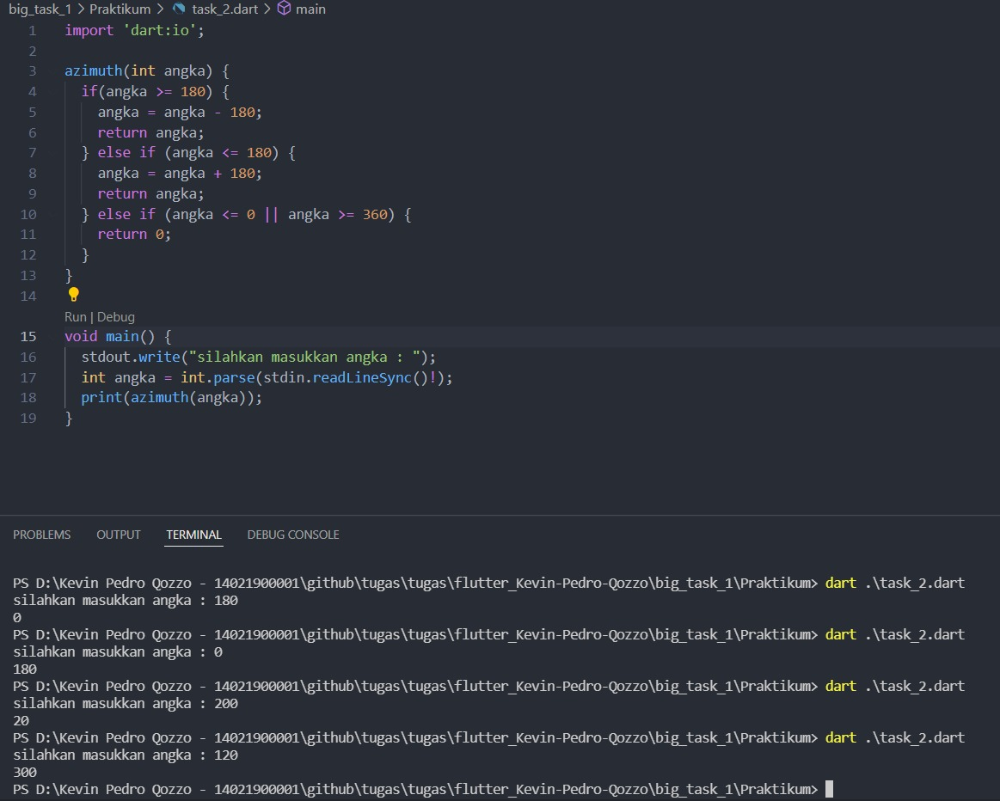

# Big task 1

## Resume

Dalam materi ini, mempelajari bagaimana cara menyelesaikan masalah berupa:

1. Ganjil atau genap
2. -
3. Jam Pasir
4. Angka diagonal

### Ganjil atau genap

dalam hal ini diharuskan membuat sebuah fungsi yang:

1. Menerima sebuah angka
2. me-return true jika masukkan genap
3. me-return false jika masukkan ganjil

[task1.go](./Praktikum/task_1.dart)

output:

### Azimuth atau back azimuth

1. Menerima sebuah angka
2. jika masukkan lebih dari 180 maka return masukkan -180
3. jika kurang dari 180 maka return masukkan +180
4. jika return kurang dari atau sama dengan 0 maka return 0
5. jika return lebih dari atau sama dengan 360 maka return 0

[task2.go](./Praktikum/task_2.dart)

output:

### Jam pasir

dalam hal ini diharuskan membuat sebuah fungsi yang:

1. Menerima sebuah angka
2. menampilkan jam pasir sesuai dengan masukan

[task3.go](./Praktikum/task_3.dart)

output:

### Angka diagonal

dalam hal ini diharuskan membuat sebuah fungsi yang:

1. Menerima sebuah angka
2. menampilkan angka secara diagonal

[task4.go](./Praktikum/task_4.dart)

output:

